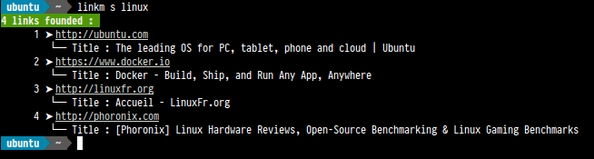

Usage
=====

:date: 2014-09-23 10:20
:tags: utilisation, usage
:slug: usage
:authors: Ferry Jérémie
:summary: Try it
:lang: en

Examples
--------

.. code-block:: bash

    linkm add http://stackoverflow.com # add a link on Database
    linkm update http://stackoverflow.com # update properties on a existent link
    linkm remove http://stackoverflow.com # remove a link on DataBase
    linkm search python linux # search a link a link on DataBase with tags
    linkm dump >| backup.json # serialize a entire Database on a JSON file
    linkm load backup.json # load a list of links on DataBase
    linkm flush # erase all DataBase

when you add/edit links, the "shell" will ask you for each one to edit tags, priority value and a description.

.. code-block:: bash

    linkm add http://djangoproject.com
        "http://djangoproject.com" properties :
            tags (separate with ",") : django, python, framework
            priority value (integer value between 1 and 10) : 5
            give a description : Django is a high-level Python Web framework that encourages rapid development and clean, pragmatic design.

Search a link (with a "linux" tag):

