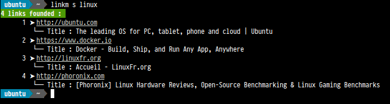

Utilisation
===========

:date: 2014-09-23 10:20
:tags: utilisation, usage
:slug: utilisation
:authors: Ferry Jérémie
:summary: Try it
:lang: fr

Examples
--------

.. code-block:: bash

    linkm add http://stackoverflow.com # ajoute un lien
    linkm update http://stackoverflow.com # mettre à jour les propriétés d'un lien déjà existant
    linkm remove http://stackoverflow.com # supprime un lien
    linkm search # renvoi l'ensemble des liens
    linkm search python linux # recherche d'un lien avec des tags
    linkm dump # affichage de la sérialisation de la base au format JSON
    linkm dump >| backup.json # sérialisation de la base au format JSON et enregistrement dans un fichier
    linkm load backup.json # chargement d'une liste de liens via un fichier JSON
    linkm flush # Vide entièrement la Base de donnée de LinkManager

Quand vous ajoutez/modifiez un lien, votre terminal vous posera un ensemble de questions afin de compléter un lien par des tags, une valeur de priorité et une description.

.. code-block:: bash

    linkm add http://djangoproject.com
        "http://djangoproject.com" properties :
            tags (separate with ",") : django, python, framework
            priority value (integer value between 1 and 10) : 5
            give a description : Django is a high-level Python Web framework that encourages rapid development and clean, pragmatic design.

Rechercher un lien (ici avec le tag "linux"):

